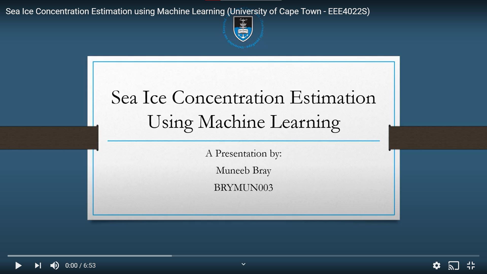

# UCT-SIC
This repository contains all the resources implemented for a Final Year Project at UCT. The projects aim is to provide a Sea Ice Concentration (SIC) model with Machine Learning

This presentation outlines the investigation conducted for my final year project as an Electrical Engineering student at the University of Cape Town.

