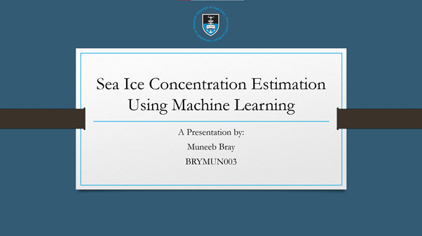

# UCT-SIC
This repository contains all the resources implemented for a Final Year Project at UCT. The projects aim is to provide a Sea Ice Concentration (SIC) model with Machine Learning

Video Thumbnail

<iframe width="560" height="315" src="https://www.youtube.com/embed/YVnLU0mbyls" frameborder="0" allow="accelerometer; autoplay; clipboard-write; encrypted-media; gyroscope; picture-in-picture" allowfullscreen></iframe>
